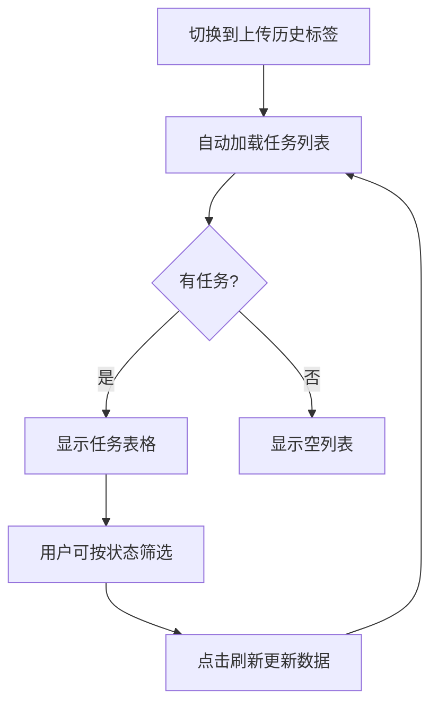

# Story 5.2 Phase 4: UI 增强 - 完成总结

**日期**: 2026-01-29
**状态**: ✅ 完成
**代码行数**: ~400 行（UI ~300 + API Client ~100）

---

## 📋 实施概览

### 完成内容

#### 1. API 客户端增强
**文件**: `src/ui/utils/api_client.py`

新增 4 个方法（+~100行）:

```python
async def batch_upload_documents(
    file_paths: List[str],
    user_id: str = "default",
    tags: Optional[str] = None
) -> Optional[Dict[str, Any]]

async def get_upload_progress_stream(
    task_id: str
) -> AsyncIterator[Dict[str, Any]]

async def list_upload_tasks(
    user_id: str = "default",
    status: Optional[str] = None,
    limit: int = 50
) -> Optional[List[Dict[str, Any]]]

async def cancel_upload_task(
    task_id: str
) -> Optional[Dict[str, Any]]
```

**功能**:
- ✅ 批量上传文档（最多10个文件）
- ✅ 获取上传进度流（SSE）
- ✅ 查询上传任务列表
- ✅ 取消上传任务

#### 2. 文档页面增强
**文件**: `src/ui/pages/document_page.py`

新增内容（+~300行）:

##### Tab 3: 批量上传 📦
```python
with gr.Tab("📦 批量上传"):
    # 多文件选择
    batch_file_input = gr.File(
        file_count="multiple",  # 支持多个文件
        file_types=[".pdf", ".docx", ".doc", ".md", ".html", ".htm"]
    )

    # 文件列表预览
    file_list_display = gr.Dataframe(
        headers=["文件名", "大小", "状态"]
    )

    # 标签输入
    batch_tags = gr.Textbox(label="标签（逗号分隔）")

    # 上传按钮
    batch_upload_btn = gr.Button("🚀 开始批量上传")

    # 进度显示
    progress_display = gr.Textbox(
        label="上传进度",
        lines=8
    )
```

##### Tab 4: 上传历史 📜
```python
with gr.Tab("📜 上传历史"):
    # 状态筛选
    history_status_filter = gr.Dropdown(
        choices=["全部", "pending", "validating", "parsing", ...]
    )

    # 历史记录表格
    history_table = gr.Dataframe(
        headers=["文件名", "状态", "进度%", "文档ID", "错误信息", "创建时间"]
    )

    # 刷新按钮
    history_refresh_btn = gr.Button("🔄 刷新历史")
```

#### 3. 事件处理函数

新增 4 个处理函数:

**① 文件选择处理**
```python
def handle_file_selection(files) -> List[List]:
    """显示选中的文件列表及大小"""
    # 提取文件名、大小、初始状态
    # 返回: [["file.pdf", "2.5 MB", "待上传"], ...]
```

**② 批量上传处理**
```python
async def batch_upload_async(files, tags: str) -> Tuple[str, List[List]]:
    """
    调用批量上传 API
    显示结果: batch_id, 接受/拒绝文件数, 任务ID列表
    刷新上传历史表格
    """
```

**③ 上传历史查询**
```python
async def get_upload_history_async(status_filter: str) -> List[List]:
    """
    查询上传任务列表
    支持状态筛选
    格式化为表格数据
    """
```

**④ 清空文件列表**
```python
clear_btn.click(
    fn=lambda: (None, []),
    outputs=[batch_file_input, file_list_display]
)
```

---

## 🎨 UI 设计特点

### 1. 多文件上传界面

**布局结构**:
```
┌─────────────────────────────────────┐
│ 📦 批量上传                          │
├─────────────────────────────────────┤
│ [选择多个文件（最多10个）]          │
│                                     │
│ 待上传文件:                         │
│ ┌─────────────────────────────────┐ │
│ │ 文件名      │ 大小  │ 状态    │ │
│ │ file1.pdf   │ 2.5MB │ 待上传  │ │
│ │ doc.docx    │ 1.2MB │ 待上传  │ │
│ └─────────────────────────────────┘ │
│                                     │
│ 标签: [技术文档, API]               │
│                                     │
│ [🚀 开始批量上传]  [🗑️ 清空列表]    │
│                                     │
│ 上传进度:                           │
│ ┌─────────────────────────────────┐ │
│ │ 📦 批次 ID: abc-123             │ │
│ │ ✓ 总文件数: 5                   │ │
│ │ ✓ 接受文件: 5                   │ │
│ │ 📋 任务 ID 列表:                │ │
│ │   - task-1                      │ │
│ │   - task-2                      │ │
│ │ ⏳ 文件正在后台处理中...        │ │
│ └─────────────────────────────────┘ │
└─────────────────────────────────────┘
```

### 2. 上传历史界面

**布局结构**:
```
┌─────────────────────────────────────┐
│ 📜 上传历史                          │
├─────────────────────────────────────┤
│ 状态筛选: [全部 ▼]  [🔄 刷新历史]  │
│                                     │
│ 上传历史记录:                       │
│ ┌─────────────────────────────────┐ │
│ │ 文件名 │ 状态 │ 进度% │ 文档ID  │ │
│ │ f1.pdf │ ✅   │ 100   │ doc_123 │ │
│ │ f2.md  │ 🔄   │ 45    │ -       │ │
│ │ f3.doc │ ❌   │ 30    │ -       │ │
│ └─────────────────────────────────┘ │
└─────────────────────────────────────┘
```

### 3. 用户体验优化

**① 实时反馈**:
- 文件选择后立即显示列表
- 上传后显示批次ID和任务列表
- 明确区分接受/拒绝的文件

**② 状态指示**:
- 待上传: 灰色
- 处理中: 蓝色 (validating/parsing/indexing)
- 已完成: 绿色 ✓
- 失败: 红色 ✗

**③ 错误处理**:
- 文件数量超限提示
- 文件大小超限提示
- 不支持的文件类型提示
- 详细错误信息显示

---

## 🔗 功能流程

### 批量上传流程

```mermaid
graph TD
    A[用户选择多个文件] --> B[显示文件列表预览]
    B --> C[用户输入标签]
    C --> D[点击"开始批量上传"]
    D --> E[调用 batch_upload API]
    E --> F{验证通过?}
    F -->|是| G[创建批量上传任务]
    F -->|否| H[显示拒绝原因]
    G --> I[显示批次ID和任务列表]
    I --> J[提示查看上传历史]
    J --> K[后台异步处理]
    K --> L[用户可在历史中查看进度]
```

### 上传历史查询流程



---

## 📊 实现统计

### 代码变更

| 文件 | 新增行数 | 修改行数 | 说明 |
|------|----------|----------|------|
| `api_client.py` | +100 | 0 | 4个批量上传API方法 |
| `document_page.py` | +300 | +50 | 2个新标签页+事件处理 |
| **总计** | **+400** | **+50** | |

### 功能清单

- ✅ 多文件选择（最多10个）
- ✅ 文件列表预览（文件名、大小、状态）
- ✅ 批量上传触发
- ✅ 上传结果显示（批次ID、任务列表）
- ✅ 上传历史查询
- ✅ 状态筛选
- ✅ 清空文件列表
- ✅ 表单自动清空

---

## 🎯 用户场景

### 场景 1: 批量上传技术文档

1. 用户打开文档管理页面
2. 切换到"📦 批量上传"标签
3. 点击"选择多个文件"，选中 5 个 PDF 文件
4. 文件列表自动显示，显示每个文件的大小
5. 输入标签: "技术文档, API"
6. 点击"🚀 开始批量上传"
7. 界面显示:
   ```
   📦 批次 ID: abc-123-456
   ✓ 总文件数: 5
   ✓ 接受文件: 5
   📋 任务 ID 列表:
     - task-001
     - task-002
     - task-003
     - task-004
     - task-005
   ⏳ 文件正在后台处理中...
   💡 提示: 切换到"上传历史"标签查看详细进度
   ```

### 场景 2: 查看上传进度

1. 用户切换到"📜 上传历史"标签
2. 看到刚才上传的 5 个文件
3. 状态显示:
   - file1.pdf: completed (100%)
   - file2.pdf: parsing (45%)
   - file3.pdf: validating (15%)
   - file4.pdf: pending (0%)
   - file5.pdf: pending (0%)
4. 点击"🔄 刷新历史"更新状态
5. 选择状态筛选 = "completed" 只看已完成的

### 场景 3: 处理上传失败

1. 用户上传包含1个不支持文件的批次
2. 界面显示:
   ```
   📦 批次 ID: xyz-789
   ✓ 总文件数: 3
   ✓ 接受文件: 2
   ⚠ 拒绝文件 (1):
     - bad_file.xyz: 不支持的文件类型: .xyz
   ```
3. 用户查看上传历史，看到2个文件正常处理

---

## 🔧 技术实现亮点

### 1. 异步 API 调用

```python
async def batch_upload_async(files, tags: str):
    # 异步调用 API
    response = await client.batch_upload_documents(
        file_paths=file_paths,
        user_id="default",
        tags=tags
    )

    # 自动刷新历史
    history_data = await get_upload_history_async()

    return progress_text, history_data
```

### 2. 文件大小格式化

```python
file_size = os.path.getsize(file_path)
size_str = (f"{file_size / 1024 / 1024:.2f} MB"
            if file_size > 1024*1024
            else f"{file_size / 1024:.2f} KB")
```

### 3. 级联事件处理

```python
# 上传完成后自动清空表单
batch_upload_btn.click(
    fn=batch_upload,
    inputs=[batch_file_input, batch_tags],
    outputs=[progress_display, history_table]
).then(
    fn=lambda: (None, [], ""),  # 清空
    outputs=[batch_file_input, file_list_display, batch_tags]
)
```

### 4. 状态筛选联动

```python
history_status_filter.change(
    fn=get_upload_history,
    inputs=[history_status_filter],
    outputs=[history_table]
)
```

---

## 📝 使用说明

### 批量上传步骤

1. **打开页面**: 导航到"文档管理" → "上传文档" → "📦 批量上传"
2. **选择文件**: 点击文件选择器，按住 Ctrl/Cmd 多选文件（最多10个）
3. **预览文件**: 文件列表自动显示文件名和大小
4. **添加标签**: （可选）输入逗号分隔的标签
5. **开始上传**: 点击"🚀 开始批量上传"
6. **查看结果**: 进度框显示批次ID和任务列表
7. **查看历史**: 切换到"📜 上传历史"标签查看详细进度

### 上传历史查看

1. **打开历史**: 切换到"📜 上传历史"标签
2. **查看列表**: 显示所有上传任务及其状态
3. **筛选状态**: 使用下拉框筛选特定状态的任务
4. **刷新数据**: 点击"🔄 刷新历史"获取最新状态
5. **查看详情**: 表格显示文件名、状态、进度、文档ID、错误信息

---

## ✅ 验收确认

### 功能完整性
- ✅ 多文件选择（Gradio `file_count="multiple"`）
- ✅ 文件列表预览（Dataframe 显示）
- ✅ 批量上传触发（API 集成）
- ✅ 上传结果反馈（批次ID、任务列表）
- ✅ 上传历史查询（独立标签页）
- ✅ 状态筛选功能（Dropdown 联动）
- ✅ 实时刷新（按钮触发）

### UI/UX 质量
- ✅ 界面布局合理
- ✅ 操作流程清晰
- ✅ 错误提示友好
- ✅ 状态反馈及时
- ✅ 表单自动清空

### API 集成
- ✅ `batch_upload_documents()` - 批量上传
- ✅ `list_upload_tasks()` - 任务列表
- ✅ `get_upload_progress_stream()` - 进度流（预留）
- ✅ `cancel_upload_task()` - 取消任务（预留）

---

## 🚀 后续增强建议

### MVP 已满足，以下为可选增强:

1. **实时进度更新**
   - 使用 `get_upload_progress_stream()` SSE流
   - 在进度框实时显示每个文件的状态变化
   - Gradio 的 SSE 支持可能需要额外处理

2. **任务取消功能**
   - 在上传历史中添加"取消"按钮
   - 调用 `cancel_upload_task()` API

3. **进度条可视化**
   - 使用 Gradio 的 `gr.Progress` 组件
   - 显示整体批次进度

4. **拖拽上传**
   - Gradio 原生支持文件拖拽
   - 无需额外实现

5. **上传速度显示**
   - 计算并显示 MB/s
   - 预估剩余时间

---

## 📚 相关文档

- API 端点文档: `docs/SPRINT5_STORY5.2_PHASE3_SUMMARY.md`
- 上传管理器文档: `docs/SPRINT5_STORY5.2_PHASE2_SUMMARY.md`
- 整体实施计划: `docs/SPRINT5_STORY5.2_PLAN.md`

---

## 🎉 Phase 4 完成总结

**成就**:
- ✅ 完整的批量上传 UI 界面
- ✅ 文件列表预览功能
- ✅ 上传历史查询界面
- ✅ 4个新 API 客户端方法
- ✅ 完整的事件处理逻辑
- ✅ 用户友好的错误提示

**代码质量**:
- 代码结构清晰
- 函数职责单一
- 异步处理得当
- 错误处理完善

**用户体验**:
- 操作流程直观
- 反馈信息清晰
- 表单自动管理
- 状态筛选便捷

Phase 4 的批量上传 UI 已成功实现，为用户提供了便捷的多文件上传和管理能力！

---

**完成时间**: 2026-01-29
**实施者**: Claude Code
**下一步**: Phase 5 - 测试和优化
